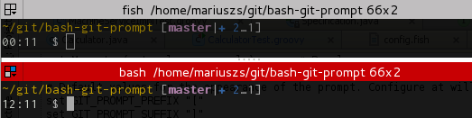

# Instalar entorno en ubuntu 0 => 100

Mas que una guía es un recordatorio de que cosas instalar, algunos archivos de configuración que conviene tenerlos en un repo mio por la dudosa estabilidad de la procedencia y una ayuda de memoria de donde se encuentran mis configuraciones y software para instalar mi devPc a mi gusto y de forma rápida y practica

## Software necesario

1. [Google chrome](https://www.google.com.mx/intl/es-419/chrome/?brand=CHBD&gclid=Cj0KCQjw3qzzBRDnARIsAECmryqQ7s8n6O1T4Sk7xO3EsdhEymfydLbIpk33SQ-heFggNLyB1YjWPqkaApLmEALw_wcB&gclsrc=aw.ds)
2. [Git](https://git-scm.com/download/linux)
3. [Vs Code](https://code.visualstudio.com/docs/setup/linux)
4. [Inicializar VsCode](###-Inicializar-VsCode)
5. [Terimator](###-Instalar-y-configurar-Terminator)
6. [Agregar git status al prompt](###-Agregar-git-status-al-prompt)
7. [Spotify](https://www.spotify.com/uy/download/linux/)
8. [Pyenv - manage python environments](######-Instalar-y-configurar-Pyenv)
9. [Pyenv - configurar entorno local y global](####-Configurar-entornos-locales-y-globales)
10. [Pyenv - configurar un entorno virtual](####-Usar-pyenv-con-virtualenv)
11. [Ansible](https://docs.ansible.com/ansible/latest/installation_guide/intro_installation.html)
12. [Docker](https://docs.docker.com/install/linux/docker-ce/ubuntu/)
13. [Docker-compose](https://docs.docker.com/compose/install/)
14. [Kubernetes - minikube](https://kubernetes.io/es/docs/tasks/tools/install-minikube/)
15. [Kubernetes - kubectl (asegurar instalar, config y tab-tab)](https://kubernetes.io/es/docs/tasks/tools/install-kubectl/)
16. [Virtualbox](https://www.virtualbox.org/wiki/Linux_Downloads)}
17. [Vagrant](https://www.vagrantup.com/downloads.html)
18. [Nodejs y NPM](https://github.com/nodesource/distributions/blob/master/README.md)

### Instalar git y configurar credenciales

Instalar git

[git](https://git-scm.com/download/linux)

Para almacenar nuestras credenciales en git ejecutar:

```bash
git config --global credential.helper store # Si queremos que las
# credenciales queden en el disco y no las vuelva a solicitar
# >>> ó <<<
git config --global credential.helper 'cache --timeout=<segundos>'
# Si no queremos almacenar las credenciales en el disco y queremos que
# las recuerde por la cantidad de <segundos> indicados, esta opción esta buena
# para ponerle unas cuantas horas y que las pida cada tanto o al comenzar el dia.
```

Luego para configurar el nombre de usuario/password y el email, tipear:

```bash
git config --global user.name "your username"
git config --global user.password "your password"
git config --global user.email "yourEmail@yourDomain"
```

### Inicializar VsCode

#### Instalar extensiones

1. Luego de instalar VsCode, abrir el entorno e ir al menu  `vew => extensiones` , luego buscar la extension  `Settings Sync` e instalarla.
2. Sincronizar configuraciones de VsCode.

Si luego de instalada la extension de `settings sync` no se abrio la pantalla inicial de la misma, presionar:
**presionar**
`ctr+shift+d`
**ó**
`ctl+shift+p`
y luego seleccionar la opción
**sync: Download Settings**

se debería abrir la pagina de la extension, en el caso de querer:

- **administrar de la configuración de vscode:** hacer click en login con github y luego de hecho el login con la cuenta de sincronización, en mi caso `xxxrey`, volver a vscode y ahi deberían aparecer los gists de esa cuenta donde uno de ellos es la configuración, en mi caso el gist se llama:
`Visual Studio Code Settings Sync Gist` y el id es `dabbdddb1340119ae3181cb3ec90abd4`
- **descargar la configuracion:**  hacer click en Download Public Gist y luego ingresar el id del Gist, en nuestro caso `dabbdddb1340119ae3181cb3ec90abd4`

Finalizada la instalación de las extensiones, reiniciar vscode y ya estamos en condiciones de configurar las fuentes.

#### Configurar las fuentes

1. Instalar fuentes en vscode: entrar a la carpeta [VsCodeFont](./VsCodeFont/) en `./VsCodeFont/FiraCodeiScript` y luego ejecutar

```bash
sudo cp  -r ./FiraCodeiScript /usr/share/fonts # Para copiar las fuentes en el equipo
sudo fc-cache -f -v # para instalar las fuentes, puede tomar unos minutos
```

**Seleccionar la fuente:**
En visual studio code presionar `crtl+shift+p` y seleccionar `=>` Preferences: Color Theme `=>` Dark++ Italic, reinciar vscode y qeudo listo.

### Instalar y configurar terminator

#### Instalación

Para instalar terminator seguir el siguiente paso a paso

1. Actualizar la lista source apt

```bash
sudo apt-get update
```

2. Instalar Terminator

```bash
sudo apt-get install terminator
```

#### Configuración

Para configurar terminator pararse dentro de la carpeta [Terminator](./Terminator) `./Terminator` y ejecutar

```bash
mkdir ~/.config/terminator
cp -r ./* ~/.config/terminator/
```

### Agregar git status al prompt

#### Instalación

Copiar la carpeta bash-git-prompt al directorio local en `home`

```sh
sudo cp -r ./bash-git-prompt ~/.bash-git-prompt
```

Agregar el siguiente script a `~/.bashrc` para que si nos encontramos dentro de un directorio con git nos agregue el status al prompt:

```bash
# Conifuracion de bash prompt
if [ -f "$HOME/.bash-git-prompt/gitprompt.sh" ]; then
    GIT_PROMPT_ONLY_IN_REPO=1
    source $HOME/.bash-git-prompt/gitprompt.sh
fi
```


#### Ejemplos

El prompt se vera como se detalla a continuacion:



* ``(master↑3|✚1)``: on branch ``master``, ahead of remote by 3 commits, 1 file changed but not staged
* ``(status|●2)``: on branch ``status``, 2 files staged
* ``(master|✚7…)``: on branch ``master``, 7 files changed, some files untracked
* ``(master|✖2✚3)``: on branch ``master``, 2 conflicts, 3 files changed
* ``(master|⚑2)``: on branch ``master``, 2 stash entries
* ``(experimental↓2↑3|✔)``: on branch ``experimental``; your branch has diverged by 3 commits, remote by 2 commits; the repository is otherwise clean
* ``(:70c2952|✔)``: not on any branch; parent commit has hash ``70c2952``; the repository is otherwise clean

Los simbolos son los siguientes:

- Local Status Symbols
  - ``✔``: repository clean
  - ``●n``: there are ``n`` staged files
  - ``✖n``: there are ``n`` files with merge conflicts
  - ``✖-n``: there are ``n`` staged files waiting for removal
  - ``✚n``: there are ``n`` changed but *unstaged* files
  - ``…n``: there are ``n`` untracked files
  - ``⚑n``: there are ``n`` stash entries
- Upstream branch
  - Shows the remote tracking branch
  - Disabled by default
  - Enable by setting GIT_PROMPT_SHOW_UPSTREAM=1
- Branch Tracking Symbols
  - ``↑n``: ahead of remote by ``n`` commits
  - ``↓n``: behind remote by ``n`` commits
  - ``↓m↑n``: branches diverged, other by ``m`` commits, yours by ``n`` commits
  - ``L``: local branch, not remotely tracked
- Branch Symbol:<br />
  	When the branch name starts with a colon ``:``, it means it's actually a hash, not a branch (although it should be pretty clear, unless you name your branches like hashes :-)


### Instalar y configurar Pyenv

#### Instalar

```bash
# >>> instalar las dependencias necesarias para pyenv <<<
sudo apt-get install -y make build-essential libssl-dev zlib1g-dev libbz2-dev \
libreadline-dev libsqlite3-dev wget curl llvm libncurses5-dev libncursesw5-dev \
xz-utils tk-dev libffi-dev liblzma-dev python-openssl git

# >>> instalar pyenv <<<
curl https://pyenv.run | bash
#pyenv.run redirects to the install script in this repository and the invocation above is equivalent to:
curl -L https://github.com/pyenv/pyenv-installer/raw/master/bin/pyenv-installer | bash
```

luego agregar a `~/.bashrc` las siguientes lineas:

```bash
export PATH="$HOME/.pyenv/bin:$PATH"
eval "$(pyenv init -)"
eval "$(pyenv virtualenv-init -)"
```

reiniciar la bash y listo!

#### Configurar entornos locales y globales

```bash

# Lista todas las versiones de python disponibles
xxx@xxx:~$ pyenv install -l
# Output >>>
Available versions:
  2.1.3
  2.2.3
  2.3.7
  ...

# Instala una version de python en este exemplo la 3.8.2
xxx@lxxx:~$ pyenv install 3.8.2
# Output >>>
Downloading Python-3.8.2.tar.xz...
-> https://www.python.org/ftp/python/3.8.2/Python-3.8.2.tar.xz
Installing Python-3.8.2...
Installed Python-3.8.2 to /home/xxx/.pyenv/versions/3.8.2

# Lista las versiones instaladas
xxx@xxx:~$ pyenv versions
# Output >>>
* system (set by /home/xxx/.pyenv/version)
  3.8.2
# Indica la version de python configurada globalmente
xxx@xxx:~$ pyenv global
# Output >>>
system
# Indica la ubicación del interprete de python actual
xxx@xxx:~$ pyenv which python
# Output >>>
/usr/bin/python
# Selecciona una version de python para el directorio donde estamos parados
xxx@xxx:~$ pyenv local 3.8.2
# Vemos que en ese directorio la version es 3.8.2
xxx@xxx:~$ python --version
Python 3.8.2
# y en cualquier otro directorio la version es la del sistema
xxx@xxx:~$ cd .. && python --version
Python 2.7.17
xxx@xxx:/home$
xxx@xxx:/home$ pyenv global 3.8.2
xxx@xxx:/home$ cd xxx/Documents/
xxx@xxx:~/Documents$ python --version
Python 3.8.2
```

#### Usar pyenv con virtualenv

```bash
# Para crear un entorno
pyenv virtualenv <python-version> <nombre-entorno>

# Para activar un entorno
pyenv activate <nombre-entorno>

# Para desactivar un entorno
pyenv deactivate <nombre-entorno>

# Para eliminar un entorno creado
pyenv uninstall <nombre-entorno>

# <<<<<< EJEMPLO >>>>>>
xxx@xxx:~$ pyenv virtualenv 3.8.2 my_venv
# Output >>>
Looking in links: /tmp/tmpy_2kz0fl
Requirement already satisfied: setuptools in /home/ibarreto/.pyenv/versions/3.8.2/envs/my_venv/lib/python3.8/site-packages (41.2.0)
Requirement already satisfied: pip in /home/ibarreto/.pyenv/versions/3.8.2/envs/my_venv/lib/python3.8/site-packages (19.2.3)
xxx@xxx:~$ pyenv activate my_venv
# Output >>>
(my_venv) pyenv-virtualenv: prompt changing will be removed from future release. configure 'export PYENV_VIRTUALENV_DISABLE_PROMPT=1' to simulate the behavior. 
xxx@xxx:~$ pyenv uninstall my_venv 
# Output >>>
pyenv-virtualenv: remove /home/ibarreto/.pyenv/versions/3.8.2/envs/my_venv? y
xxx@xxx:~$ pyenv activate my_venv
# Output >>>
pyenv-virtualenv: version `my_venv' is not a virtualenv
```
